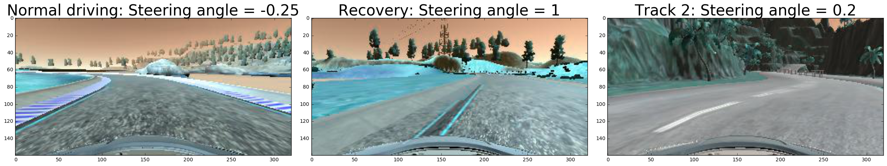
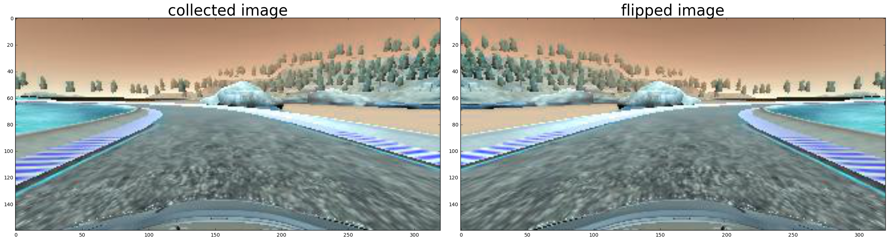
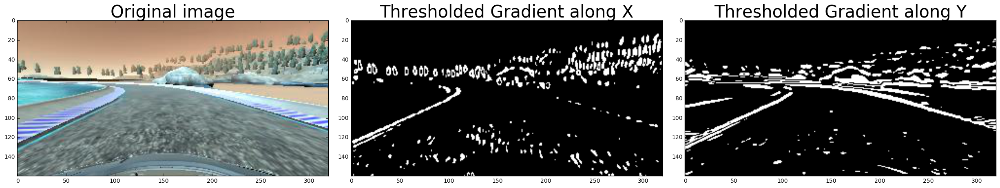
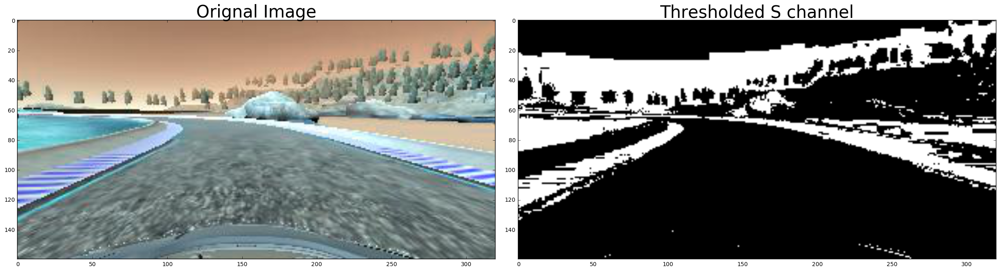
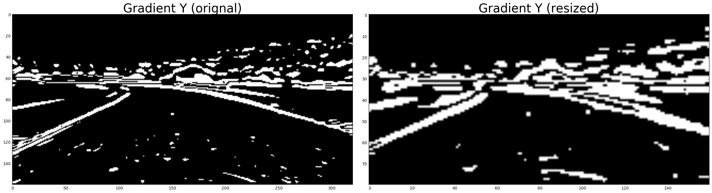
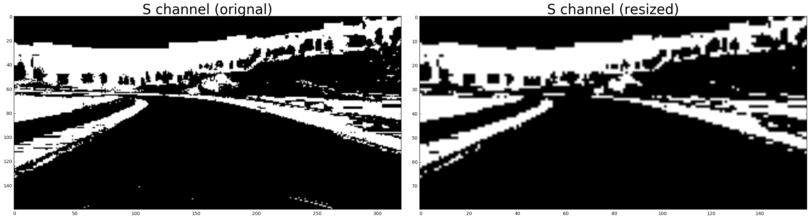
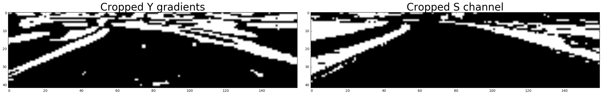
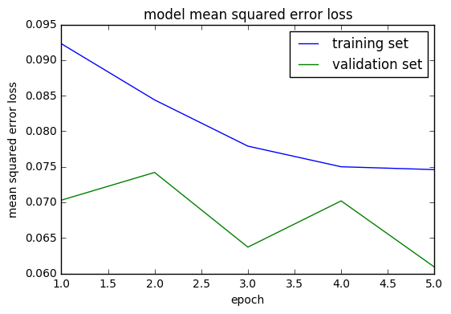
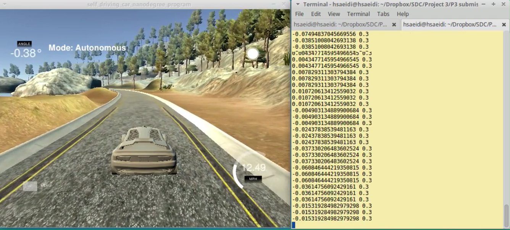

# **Behavioral Cloning** 

### *Abstract*

In this project, deep learning techniques are utilized to enable a simulated car to drive autonomously on a test track. To achieve this goal, a set of training data from the track is collected when a human driver controls the car via computer keyboard. More specifically, the road images from car's camera and the corresponding steering angle are collected as good examples of driving such that a neural network can be trained to clone the human behavior. The different steps of implementation of this project are according to the following.

1) Collecting enough data.

2) Preprocessing the images to extract necessary information.

3) Selecting a model architecture.

4) Training and testing the network.

The details are included in the following.


***


```python
# Code Cell 1: some useful visualization functions

#importing some useful packages
import matplotlib.pyplot as plt
import matplotlib.image as mpimg
import numpy as np
import cv2
import math
%matplotlib inline

###############Some general functions used in most of the steps

# Take two images with their titles and plot them next to each other
def plot2figs(fig1,title1,fig2,title2):
    f, (ax1, ax2) = plt.subplots(1, 2, figsize=(24, 9))
    f.tight_layout()
    # plot a color image 
    if len(fig1.shape) == 3:
        ax1.imshow(fig1)
    # or if it is black and white, use a gray color mapping
    else:
        ax1.imshow(fig1, cmap='gray')
    ax1.set_title(title1, fontsize=30)
    if len(fig2.shape) == 3:
        ax2.imshow(fig2)
    else:
        ax2.imshow(fig2, cmap='gray')
    ax2.set_title(title2, fontsize=30)
    plt.subplots_adjust(left=0., right=1, top=0.9, bottom=0.)
    plt.show()

# Take three images with their titles and plot them next to each other    
def plot3figs(fig1,title1,fig2,title2,fig3,title3):
    f, (ax1, ax2, ax3) = plt.subplots(1, 3, figsize=(24, 9))
    f.tight_layout()
    if len(fig1.shape) == 3:
        ax1.imshow(fig1)
    else:
        ax1.imshow(fig1, cmap='gray')
    ax1.set_title(title1, fontsize=30)
    if len(fig2.shape) == 3:
        ax2.imshow(fig2)
    else:
        ax2.imshow(fig2, cmap='gray')
    ax2.set_title(title2, fontsize=30)
    if len(fig3.shape) == 3:
        ax3.imshow(fig3)
    else:
        ax3.imshow(fig3, cmap='gray')
    ax3.set_title(title3, fontsize=30)
    plt.subplots_adjust(left=0., right=1, top=0.9, bottom=0.)
    plt.show()
    
# converting to gray scale
def grayscale(img):
    return cv2.cvtColor(img, cv2.COLOR_BGR2GRAY)

#Different functions for processing the road images using different types of gradients and color space filtering


# calculate gradient along x or y => apply thresholds on them => make a binary output for pixels
def abs_sobel_thresh(img, orient='x', sobel_kernel=3, thresh=(0, 255)):
    # 1) Convert to grayscale
    gray = grayscale(img)
    # 2) Take the derivative in x or y given orient = 'x' or 'y'
    if orient == 'x':
        sobel = cv2.Sobel(gray, cv2.CV_64F, 1, 0, ksize = sobel_kernel)
    elif orient == 'y':
        sobel = cv2.Sobel(gray, cv2.CV_64F, 0, 1, ksize = sobel_kernel)
    # 3) Take the absolute value of the derivative or gradient
    abs_sobel = np.absolute(sobel)
    # 4) Scale to 8-bit (0 - 255) then convert to type = np.uint8
    scaled_sobel = np.uint8(255*abs_sobel/np.max(abs_sobel))
    # 5) Create a mask of 1's where the scaled gradient magnitude 
            # is > thresh_min and < thresh_max
    binary_output = np.zeros_like(scaled_sobel)
    binary_output[(scaled_sobel >= thresh[0]) & (scaled_sobel <= thresh[1])] = 1
    # 6) Return this mask as your binary_output image
    return binary_output

#calculate magnitude of gradients along x and y => apply thresholds on them => make a binary output for pixels
def mag_thresh(img, sobel_kernel=3, mag_thresh=(0, 255)):
    # convert to grayscale
    gray = grayscale(img)
    # Take both Sobel x and y gradients
    sobelx = cv2.Sobel(gray, cv2.CV_64F, 1, 0, ksize=sobel_kernel)
    sobely = cv2.Sobel(gray, cv2.CV_64F, 0, 1, ksize=sobel_kernel)
    # Calculate the gradient magnitude
    gradmag = np.sqrt(sobelx**2 + sobely**2)
    # Rescale to 8 bit
    scale_factor = np.max(gradmag)/255 
    gradmag = (gradmag/scale_factor).astype(np.uint8) 
    # Create a binary image of ones where threshold is met, zeros otherwise
    binary_output = np.zeros_like(gradmag)
    binary_output[(gradmag >= mag_thresh[0]) & (gradmag <= mag_thresh[1])] = 1
    # Return the binary image
    return binary_output

# calculate the direction of gradients and apply thresholds on them=> return a binary output
def dir_threshold(img, sobel_kernel=3, thresh=(0, np.pi/2)):
    gray = grayscale(img)
    # Calculate the x and y gradients
    sobelx = cv2.Sobel(gray, cv2.CV_64F, 1, 0, ksize=sobel_kernel)
    sobely = cv2.Sobel(gray, cv2.CV_64F, 0, 1, ksize=sobel_kernel)
    # Take the absolute value of the gradient direction, 
    # apply a threshold, and create a binary image result
    absgraddir = np.arctan2(np.absolute(sobely), np.absolute(sobelx))
    binary_output =  np.zeros_like(absgraddir)
    binary_output[(absgraddir >= thresh[0]) & (absgraddir <= thresh[1])] = 1
    return binary_output


# Filter the image using color spaces
def hls_select(img, thresh=(0, 255)):
    # 1) Convert to HLS color space
    hls = cv2.cvtColor(img, cv2.COLOR_RGB2HLS)
    # 2) separate the Saturation and Light channels
    S = hls[:,:,2]
    L = hls[:,:,1]
    binary_output = np.zeros_like(S)
    light_filter = np.zeros_like(L)
    # 3) Apply the thresholds to the channels and return a binary image of threshold result
    binary_output[(S > thresh[0]) & (S <= thresh[1])] = 1
    light_filter[(L > thresh[0]) & (L <= thresh[1])] = 1
    # Here is use the logical and of Saturation and Light channels to make sure the shaded frames do not produce imaginary 
    # line detection results (e.g. imaginary horizontal lane lines when passing under a tree) This helped me to track the lines
    # better than just using S channel 
    return binary_output

```

# *Step 1: Data Collection*

For this step, I collected driving data (images and steering angles) for

1) 4 laps of clockwise normal driving (at the center of road) on track 1 (the main track to be tested).

2) 1 lap of counter clockwise normal driving on track 1 (for generalization).

3) 1 lap of recovery driving (getting the car off the shoulders and to the main road to teach the NN how to return back to the road).

4) 1 lap of driving in normal conditions on track 2 (for generalization)

5) Flipping all of the images horizontally to double the training data and allow more generalization.

Examples images and steering angles can be seen in the following plots.


```python
import csv

samples = []
with open('data/driving_log.csv') as csvfile:
    reader = csv.reader(csvfile)
    for line in reader:
        if line[0] != 'center':
            samples.append(line)
print('Total number of collected samples: ',len(samples))


name = samples[2000][0]
angle_normal = samples[2000][3]
image_normal = cv2.imread(name)
text_normal = 'Normal driving: Steering angle = '+ str(angle_normal)

name = samples[7137][0]
angle_t2 = samples[7137][3]
image_t2 = cv2.imread(name)
text_t2 = 'Track 2: Steering angle = '+ str(angle_t2)

name = samples[5705][0]
angle_recovery = samples[5705][3]
image_recovery = cv2.imread(name)
text_recovery = 'Recovery: Steering angle = '+ str(angle_recovery)

print('Examples of the images and the corresponding steering angles from the collected data')
plot3figs(image_normal,text_normal, image_recovery,text_recovery, image_t2,text_t2)

print('Flipping images to produce more training data and provide better generalization which results in', 2*len(samples), ' samples')
plot2figs(image_normal,'collected image', np.fliplr(image_normal), 'flipped image')
```

    Total number of collected samples:  7344
    Examples of the images and the corresponding steering angles from the collected data





    Flipping images to produce more training data and provide better generalization which results in 14688  samples





# Step 2: Preprocessing the images to extract necessary information.

I realized that the original images recorded from simulator contain a lot of unnecessary informaion and are not in the best possible format. Elimnating this unnecessary information can help the neural network learn more efficiently. It will also reduce the training required time since inputs with smaller sizes are processed in the neural netwokr and the hence the number of weights and biases decrease in this case. I took some steps to preprocess these images and extract more essential information from the original images according to the following.

2.1) First of all, I realized that curbs, shoulders, and other road margins appear in the form of curves with different curvatures for left and right road margins in different locations of the road. This is independent of their color. Therefore, instead of the original RGB images, I decided to filter the images into grayscale and apply some thresholded gradients (using Sobel function) along different axes to find these curves. I also, transformend the images and used S channel info to augment the gradients and find more infomration about the road boundaries (lines 84-87 model.py)


```python
ksize = 11 # Choose a larger odd number to smooth gradient measurements

# Apply each of the thresholding functions
# thresholded gradient along X
gradx = abs_sobel_thresh(image_normal, orient='x', sobel_kernel=ksize, thresh=(50, 150))
# thresholded gradient along Y
grady = abs_sobel_thresh(image_normal, orient='y', sobel_kernel=ksize, thresh=(50, 150))

print('Applying and examining different gradient methods')
# plotting the results
plot3figs(image_normal,'Original image', gradx,'Thresholded Gradient along X',grady, 'Thresholded Gradient along Y')
plt.show()

print('Applying and examining the hls color space filtering')
# apply a color space filtering and thresholding on the image
hls_binary = hls_select(image_normal, thresh=(90, 255))

# Plot the result
plot2figs(image_normal, 'Orignal Image', hls_binary,'Thresholded S channel')


```

    Applying and examining different gradient methods





    Applying and examining the hls color space filtering





From the results, it seems that gradient along Y axis and S channel info provide more insight about the condition of car on the road. Therefore, I used this info as two seperate channels for the images that go to the neural network as input and hence I reduced the number of channels to 2 from the original 3.

2.2) Then, I tried to downsample the images and check if the results provide enough information or not. In the plots below, it can be seen that the results are still acceptable. This can reduce the size of NN input to 0.25% of the 2-channel filtered image (line 82 of model.py).


```python

image_resized = cv2.resize(image_normal,None,fx=0.5, fy=0.5, interpolation = cv2.INTER_AREA)


grady_resized = abs_sobel_thresh(image_resized, orient='y', sobel_kernel=ksize, thresh=(50, 150))

hls_binary_resized = hls_select(image_resized, thresh=(90, 255))


print('resized image from 320x160 to 160x80')
plot2figs(grady, 'Gradient Y (orignal)', grady_resized,'Gradient Y (resized)')
plot2figs(hls_binary, 'S channel (orignal)', hls_binary_resized,'S channel (resized)')

filtered_resized_image = np.zeros((80,160,2))
# applying the sobel transformation and color space filtering and putting the in the channels of the filtered image
filtered_resized_image[:,:,0] = grady_resized
filtered_resized_image[:,:,1] = hls_binary_resized
```

    resized image from 320x160 to 160x80








2.3) In the next step, I removed the unnecessary parts of the image from the top (trees or other useless parts that do not convey road information) and bottom (mostly pure black parts or the car hood). From the 160x80 image in the previous step, I removed 28 from top and 10 from bottom to get a 160x42 image (line 123 of model.py) containing the most necessary road information (see figures below).


```python
top_crop = 28
bottom_crop = 10
filtered_resized_cropped_image = filtered_resized_image[top_crop:filtered_resized_image.shape[0]-bottom_crop, 0:filtered_resized_image.shape[1]]

plot2figs(filtered_resized_cropped_image[:,:,0], 'Cropped Y gradients', filtered_resized_cropped_image[:,:,1],'Cropped S channel')
```





2.4) Eventually, in the code, I transformed the channels from the range [0,1] to [-1,1] in line 125 of the model.py code.


# Step 3: Selecting a model architecture.

I chose the following architecture for the NN used in this project:

1) A Cropping2D layer for converting the 160x80x2 image to the 160x42x2.

2) A Lambda layer for changing the fomat of pixels from [0,1] to [-1,1].

3) Convolution layer with input 160x42x2 and a 5x5 filter of depth 24 with the nonlinear exponential linear unit (ELU) activation.

4) A 50% dropout for adding robustness and preventing overfitting.

5) Convolution layer with input 5x5x24 and a 5x5 filter of depth 36 with ELU activation.

6) A 50% dropout for adding robustness and preventing overfitting.

7) Convolution layer with input 5x5x36 and a 5x5 filter of depth 48 with ELU activation.

8) A 50% dropout for adding robustness and preventing overfitting.

9) Convolution layer with input 5x5x48 and a 3x3 filter of depth 64 with ELU activation.

10) A 50% dropout for adding robustness and preventing overfitting.

11) Convolution layer with input 3x3x24 and a 3x3 filter of depth 64 with ELU activation.

12) A 50% dropout for adding robustness and preventing overfitting.

13) A maxpooling layer for the last convlution layer

14) A flat dense layer of size 1000 with ELU activation.

15) A dense layer of size 100 with ELU activation.

16) A dense layer of size 50 with ELU activation.

17) A dense layer of size 20 with ELU activation.

18) A dense layer of size 1 without activation function (linear output) for producing the steering angle in the range [-25, 25].

The main structure is taken from the Nvidia arcitecture. However, some modifications in the input size and cropping are applied to make it suitable and fast for the current problem.


# Step 4: Training and testing the network.

I used mean squared error (mse) metric with adam optimizer along with data generator functions to train the NN. One example of the training results can be seen in the following figure. In this figure, both the training loss and validation loss gradually decrease over time. I stopped the training at the 5th epoch and got reasonable autonomous driving results on the simulator. Therefore, I did not feel a need for further training of the NN and increasing the chance overfitting.


```python
train_loss = [0.0923, 0.0844, 0.0779, 0.0750, 0.0746]
val_loss = [0.0703, 0.0742, 0.0637, 0.0702, 0.0609]
epochs = [1,2,3,4,5]
plt.plot(epochs,train_loss)
plt.plot(epochs,val_loss)
plt.title('model mean squared error loss')
plt.ylabel('mean squared error loss')
plt.xlabel('epoch')
plt.legend(['training set', 'validation set'], loc='upper right')
plt.show()

```





See model.py file for the training and drive.py for the autonomous driving using the saved model files model.json and model.h5. The result video is in the following link.

[](https://youtu.be/zNA0tGjbUYM)


```python

```
