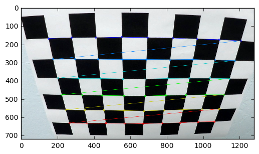

# **Advanced Lane Lines on the Road** 
***
In this project, I wrote a pipeline for lane detection using different methods according to the following steps 

Step 0: Find the camera matrix and distortion coefficents so that I can calibrate the camera and undistort images in a
    loop for processing video files. I used "cv2.findChessboardCorners" function to find the corners in each image and store them in a larger "imgpoints" vector which I used along with the "objpoints" (object points) in the "cv2.calibrateCamera" function to find camera matrix and distortion coefficients.
    
Then, for each frame in the video files I do the following steps to find the detect the lanes and 

Step 1: Undistort the image. I use "cv2.undistort" to do so (see "Functions for step 1" in following cells). 

Step 2: Apply different thresholded gradient-based filtering of the image such as gradient along x, y, directional gradients, and magnitude of gradients. I used "cv2.Sobel" function as the core with some simple calculations to compute each gradient.

Step 3: Apply the hls color space filtering of the image. I transform the image to hls space using "cv2.cvtColor" and then process the channels to detect the location of the lanes. 

Step 4: Combine the best results of step 2 and step 3 for detecting lanes. 

Step 5: Unwarp the best results of steps 1-4. I use "cv2.getPerspectiveTransform" function a along with destination and source points (defining the region of interest) to achieve this. 

Step 6: Find the left and right curves from the warped image. I used a sliding window method with histograms to find the position of the lane pixels in the frame. Then a simple 2nd order polynomial is fit to the pixels to estimate the lane curves.

Step 7: Calculate the road curvature and car position and show them on the road image. I performed a set of simple mathematical calculations based on the x= A*y^2+B*y+C equation to find the curvature. I also found the location of the bases of left and right curves as well as the center of frame (car) to calculate the car position. Finally, in order to put the curves on the original image, I used "cv2.getPerspectiveTransform" with a reveresed desitination and source coordinates compared to step 5 for the detectd curves. 


```python
# Code Cell 1

#importing some useful packages
import matplotlib.pyplot as plt
import matplotlib.image as mpimg
import numpy as np
import cv2
import math
%matplotlib inline

###############Some general functions used in most of the steps

# Take two images with their titles and plot them next to each other
def plot2figs(fig1,title1,fig2,title2):
    f, (ax1, ax2) = plt.subplots(1, 2, figsize=(24, 9))
    f.tight_layout()
    # plot a color image 
    if len(fig1.shape) == 3:
        ax1.imshow(fig1)
    # or if it is black and white, use a gray color mapping
    else:
        ax1.imshow(fig1, cmap='gray')
    ax1.set_title(title1, fontsize=30)
    if len(fig2.shape) == 3:
        ax2.imshow(fig2)
    else:
        ax2.imshow(fig2, cmap='gray')
    ax2.set_title(title2, fontsize=30)
    plt.subplots_adjust(left=0., right=1, top=0.9, bottom=0.)
    plt.show()

# Take three images with their titles and plot them next to each other    
def plot3figs(fig1,title1,fig2,title2,fig3,title3):
    f, (ax1, ax2, ax3) = plt.subplots(1, 3, figsize=(24, 9))
    f.tight_layout()
    if len(fig1.shape) == 3:
        ax1.imshow(fig1)
    else:
        ax1.imshow(fig1, cmap='gray')
    ax1.set_title(title1, fontsize=30)
    if len(fig2.shape) == 3:
        ax2.imshow(fig2)
    else:
        ax2.imshow(fig2, cmap='gray')
    ax2.set_title(title2, fontsize=30)
    if len(fig3.shape) == 3:
        ax3.imshow(fig3)
    else:
        ax3.imshow(fig3, cmap='gray')
    ax3.set_title(title3, fontsize=30)
    plt.subplots_adjust(left=0., right=1, top=0.9, bottom=0.)
    plt.show()
    
# converting to gray scale
def grayscale(img):
    return cv2.cvtColor(img, cv2.COLOR_BGR2GRAY)
```

# * Briefly state how you computed the camera matrix and distortion coefficients. Provide an example of a distortion corrected calibration image.*


I used "cv2.findChessboardCorners" function to find the corners in each image and store them in a larger "imgpoints" vector which I used along with the "objpoints" (object points) in the "cv2.calibrateCamera" function to find camera matrix and distortion coefficients. Details are in the following cell (see the code cells 2 and 3 in the IPython notebook P4-final-writeup.ipynb)


```python
# Code Cell 2
############################Functions for step 0 (calibration)
# Find the corner points
def find_and_plot_corners(img, imgpoints, objpoints, objp, ctr, example_image):
    if example_image == ctr:
        print('This is an example image of:', type(img), 'with dimesions:', img.shape)
        plt.imshow(img)
        plt.show()
    # convert to gray scale
    gray = grayscale(img)
    # Find the chessboard corners
    ret, corners = cv2.findChessboardCorners(gray, (nx, ny), None)
    # If successfully found the corners, add the to the list of image points and add a corresponding object point to the list
    if ret == True:
        imgpoints.append(corners)
        objpoints.append(objp)
        # Plotting an example image
        if example_image == ctr:
            print('Example of the original image with its corners detected')
            cv2.drawChessboardCorners(img, (nx, ny), corners, ret)
            plt.imshow(img)
            plt.show()
            
# This function finds the camera parameters given the image points and objpoints and the dimension            
def camera_params(objpoints, imgpoints, imgdims):
    ret, mtx, dist, rvecs, tvecs = cv2.calibrateCamera(objpoints, imgpoints, imgdims,None,None)
    return mtx, dist

######################Functions for step 1: undistorting images
# This function undistorts an image using the camera matrix and distortion coefficients   
def img_undistort(img, mtx, dist):
    undist = cv2.undistort(img, mtx, dist, None, mtx)
    return undist

```


```python
# Code Cell 3

# This cell reads the calibration images and finds the coreners as well as object points and calibrates the camera (i.e. finds
# camera matrix and distortion coefficients)
import glob
# prepare object points
nx = 9 #The number of inside corners along x
ny = 6 #The number of inside corners along y

print('Step 0: calibrating and testing the camera')
# read the calibaration images
images = glob.glob('camera_cal/calibration*.jpg')
# define empty lists for storing object points and image points
objpoints = []
imgpoints = []

# create a three-column vector for the list of object points=> the third cooridnate is set to zero
objp = np.zeros((nx*ny,3), np.float32)
# make a meshgrid and put it in the column format
objp[:,:2] = np.mgrid[0:nx,0:ny].T.reshape(-1,2)

# start processing the calibration images to find their corners
example_image = 3 # a variable for plotting some sample results
ctr = 0 # a counter 
for fname in images:
    ctr += 1
    img = cv2.imread(fname)
    find_and_plot_corners(img, imgpoints, objpoints, objp, ctr, example_image)
    
#calculate the camera matrix and distorition coefficients
mtx, dist = camera_params(objpoints, imgpoints, img.shape[0:2])   


print('Testing how the undistorting function works on the calibration images')
ctr = 0
for fname in images:
    ctr += 1
    # undistort an example image and plot it
    if ctr == example_image:
        img = cv2.imread(fname)
        undistorted = img_undistort(img,mtx,dist)
        plot2figs(img,'Original Image',undistorted,'Undistorted Image')
        plt.show()

```

    Step 0: calibrating and testing the camera
    This is an example image of: <class 'numpy.ndarray'> with dimesions: (720, 1280, 3)


    Example of the original image with its corners detected





    Testing how the undistorting function works on the calibration images


# Provide an example of a distortion-corrected image.
Run the code cells 4 in the IPython notebook P4-final-writeup.ipynb


```python
# Code Cell 4
#reading in an example image and processing it
image = mpimg.imread('extra10.jpg')
#printing out some stats and plotting
print('This image is:', type(image), 'with dimesions:', image.shape)
# undistort it and name it image_undistorted
image_undistorted = img_undistort(image,mtx,dist)
print('Step 1: undistorting the image')
plot2figs(image, 'Original Image', image_undistorted, 'Undistorted Image')
```

    This image is: <class 'numpy.ndarray'> with dimesions: (720, 1280, 3)
    Step 1: undistorting the image


# Describe how (and identify where in your code) you used color transforms, gradients or other methods to create a thresholded binary image. Provide an example of a binary image result.

I used steps 2-4 at the beginning of this document. I summarize them in the following:

In Step 2, I used "cv2.Sobel" function as the core with some simple calculations to compute gradients along x, y, directional gradients, and magnitude of gradients. In Step 3, I transformed the image to hls space using "cv2.cvtColor" and then processed the channels to detect the location of the lanes. In Step 4, I Combined the best results of step 2 and step 3 for detecting lanes (i.e. gradient along x with the filtered S channel). See the code cells 5 and 6 in the IPython notebook P4-final-writeup.ipynb.


```python
# Code Cell 5
# This cell contains different functions for processing the images

# After the calibration phase and calculating the camera matrix and camera distortions, we can use the following 
# functions to process a road image using different types of gradients and color space filtering

#######################################Fucntions for step 2

# calculate gradient along x or y => apply thresholds on them => make a binary output for pixels
def abs_sobel_thresh(img, orient='x', sobel_kernel=3, thresh=(0, 255)):
    # 1) Convert to grayscale
    gray = grayscale(img)
    # 2) Take the derivative in x or y given orient = 'x' or 'y'
    if orient == 'x':
        sobel = cv2.Sobel(gray, cv2.CV_64F, 1, 0, ksize = sobel_kernel)
    elif orient == 'y':
        sobel = cv2.Sobel(gray, cv2.CV_64F, 0, 1, ksize = sobel_kernel)
    # 3) Take the absolute value of the derivative or gradient
    abs_sobel = np.absolute(sobel)
    # 4) Scale to 8-bit (0 - 255) then convert to type = np.uint8
    scaled_sobel = np.uint8(255*abs_sobel/np.max(abs_sobel))
    # 5) Create a mask of 1's where the scaled gradient magnitude 
            # is > thresh_min and < thresh_max
    binary_output = np.zeros_like(scaled_sobel)
    binary_output[(scaled_sobel >= thresh[0]) & (scaled_sobel <= thresh[1])] = 1
    # 6) Return this mask as your binary_output image
    return binary_output

#calculate magnitude of gradients along x and y => apply thresholds on them => make a binary output for pixels
def mag_thresh(img, sobel_kernel=3, mag_thresh=(0, 255)):
    # convert to grayscale
    gray = grayscale(img)
    # Take both Sobel x and y gradients
    sobelx = cv2.Sobel(gray, cv2.CV_64F, 1, 0, ksize=sobel_kernel)
    sobely = cv2.Sobel(gray, cv2.CV_64F, 0, 1, ksize=sobel_kernel)
    # Calculate the gradient magnitude
    gradmag = np.sqrt(sobelx**2 + sobely**2)
    # Rescale to 8 bit
    scale_factor = np.max(gradmag)/255 
    gradmag = (gradmag/scale_factor).astype(np.uint8) 
    # Create a binary image of ones where threshold is met, zeros otherwise
    binary_output = np.zeros_like(gradmag)
    binary_output[(gradmag >= mag_thresh[0]) & (gradmag <= mag_thresh[1])] = 1
    # Return the binary image
    return binary_output

# calculate the direction of gradients and apply thresholds on them=> return a binary output
def dir_threshold(img, sobel_kernel=3, thresh=(0, np.pi/2)):
    gray = grayscale(img)
    # Calculate the x and y gradients
    sobelx = cv2.Sobel(gray, cv2.CV_64F, 1, 0, ksize=sobel_kernel)
    sobely = cv2.Sobel(gray, cv2.CV_64F, 0, 1, ksize=sobel_kernel)
    # Take the absolute value of the gradient direction, 
    # apply a threshold, and create a binary image result
    absgraddir = np.arctan2(np.absolute(sobely), np.absolute(sobelx))
    binary_output =  np.zeros_like(absgraddir)
    binary_output[(absgraddir >= thresh[0]) & (absgraddir <= thresh[1])] = 1
    return binary_output

#######################################Fucntions for step 3
# Filter the image using color spaces
def hls_select(img, thresh=(0, 255)):
    # 1) Convert to HLS color space
    hls = cv2.cvtColor(img, cv2.COLOR_RGB2HLS)
    # 2) separate the Saturation and Light channels
    S = hls[:,:,2]
    L = hls[:,:,1]
    binary_output = np.zeros_like(S)
    light_filter = np.zeros_like(L)
    # 3) Apply the thresholds to the channels and return a binary image of threshold result
    binary_output[(S > thresh[0]) & (S <= thresh[1])] = 1
    light_filter[(L > thresh[0]) & (L <= thresh[1])] = 1
    # Here is use the logical and of Saturation and Light channels to make sure the shaded frames do not produce imaginary 
    # line detection results (e.g. imaginary horizontal lane lines when passing under a tree) This helped me to track the lines
    # better than just using S channel 
    return binary_output*light_filter
######################################## Step 4 did not need any complicated fucntions
```


```python
# Code Cell 6
ksize = 3 # Choose a larger odd number to smooth gradient measurements

# Apply each of the thresholding functions
# thresholded gradient along X
gradx = abs_sobel_thresh(image_undistorted, orient='x', sobel_kernel=ksize, thresh=(50, 150))
# thresholded gradient along Y
grady = abs_sobel_thresh(image_undistorted, orient='y', sobel_kernel=ksize, thresh=(50, 150))

print('Step 2: applying and examining different gradient methods')
# plotting the results
plot3figs(image_undistorted,'Undistorted Image', gradx,'Thresholded Gradient x',grady, 'Thresholded Gradient y')

# calculate the magnitude of gradients and apply thresholds on them
mag_binary = mag_thresh(image_undistorted, sobel_kernel=9, mag_thresh=(30, 100))
# Plot the result
plot2figs(image_undistorted, 'Undistorted Image', mag_binary,'Thresholded Magnitude')


# calculate the direction of gradients and apply thresholds on them
dir_binary = dir_threshold(image_undistorted, sobel_kernel=15, thresh=(0.7, 1.3))
# Plot the result
plot2figs(image_undistorted, 'Undistorted Image', dir_binary,'Thresholded Grad. Dir.')


combined = np.zeros_like(dir_binary)
# Either use the gradients along x and y axes, or use what the gradient magnitudes and gradient directions agree on
combined[((gradx == 1) & (grady == 1)) | ((mag_binary == 1) & (dir_binary == 1))] = 1

plot2figs(image_undistorted, 'Undistorted Image', combined,'Combined all gradients.')

print('Step 3: applying and examining the hls color space filtering')
# apply a color space filtering and thresholding on the image
hls_binary = hls_select(image_undistorted, thresh=(90, 255))
# Plot the result
plot2figs(image_undistorted, 'Undistorted Image', hls_binary,'Thresholded S')


print('Step 4: trying combinations of HLS and gradients')
combined_binary = np.zeros_like(gradx)
combined_binary[(hls_binary == 1) | (gradx == 1)] = 1

# Plotting thresholded images
plot3figs(gradx, 'Gradient X', hls_binary,'S channel', combined_binary, 'Combined S channel and gradient thresholds')
```

    Step 2: applying and examining different gradient methods


    Step 3: applying and examining the hls color space filtering


    Step 4: trying combinations of HLS and gradients


# Describe how (and identify where in your code) you performed a perspective transform and provide an example of a transformed image.

As the step 5, I used "cv2.getPerspectiveTransform" function a along with destination and source points (defining the region of interest) to achieve this. 
Destination points ([200,1],[200,720],[1080,720],[1080,1])
Source points ([576,450], [704,450], [1190,720], [90,720])

See the code cells 7 and 8 in the IPython notebook P4-final-writeup.ipynb)


```python
# Code Cell 7

#######################################Fucntions for step 5
def corners_unwarp(img):
    # Grab the image shape
    img_size = (img.shape[1], img.shape[0])
    # use a region of interest in front of the car for finding the lane lines
    src = np.float32([[576,450], [704,450], [1190,720], [90,720]])
    offset = 200
    # define a destination image for unwraping the source image
    dst = np.float32([[offset, 1], [img_size[0]-offset, 1], 
                                 [img_size[0]-offset, img_size[1]-1], 
                                 [offset, img_size[1]-1]])

    # Given src and dst points, calculate the perspective transform matrix
    M = cv2.getPerspectiveTransform(src, dst)
    # Warp the image using OpenCV warpPerspective()
    warped = cv2.warpPerspective(img, M, img_size)
    return warped, M

```


```python
# Code Cell 8

print('Step 5: unwarping the best results of steps 1-4')
binary_warped, perspective_M = corners_unwarp(combined_binary)
plot2figs(combined_binary, 'Combined S channel and gradient thresholds', binary_warped, 'Undistorted and Warped Image')

```

    Step 5: unwarping the best results of steps 1-4


# Describe how (and identify where in your code) you identified lane-line pixels and fit their positions with a polynomial?

As the step 6, I used a sliding window method with histograms to find the position of the lane pixels in the warped image. Then a simple 2nd order polynomial is fit to the pixels to estimate the left and right lane curves. See the following results as well as the code cells 9 and 10 in the IPython notebook P4-final-writeup.ipynb.


```python
#Code Cell 9

######################################Functions for step 6
# using sliding window method to find the lane pixles and then fit some curves to them
def find_lane_curves_image(binary_warped):
    histogram = np.sum(binary_warped[binary_warped.shape[0]/3:,:], axis=0)
    #plt.plot(histogram)
    #plt.show()
    # Create an output image to draw on and  visualize the result
    out_img = np.dstack((binary_warped, binary_warped, binary_warped))*255

    # Find the midpoint of the horizontal axis on the histogram
    midpoint = np.int(histogram.shape[0]/2)
    # find the left lane base
    leftx_base = np.argmax(histogram[:midpoint])
    # find the right lane base
    rightx_base = np.argmax(histogram[midpoint:]) + midpoint
    # Find the peak of the left and right halves of the histogram
    # for debugging
    #print('Left base is at this pixel: ',leftx_base)
    #print('Right base is at this pixel: ',rightx_base)

    # Choose the number of sliding windows
    nwindows = 9
    # Set height of windows
    window_height = np.int(binary_warped.shape[0]/nwindows)

    # Identify the x and y positions of all nonzero pixels in the image
    nonzero = binary_warped.nonzero()
    nonzeroy = np.array(nonzero[0])
    nonzerox = np.array(nonzero[1])
    # Current positions to be updated for each window
    leftx_current = leftx_base
    rightx_current = rightx_base
    # Set the width of the windows +/- margin
    margin = 100
    # Set minimum number of pixels found to recenter window
    minpix = 50
    # Create empty lists to receive left and right lane pixel indices
    left_lane_inds = []
    right_lane_inds = []

    # Step through the windows one by one
    for window in range(nwindows):
        # Find the bottom edge of window
        win_y_low = binary_warped.shape[0] - (window+1)*window_height
        # Find the top edge of window
        win_y_high = binary_warped.shape[0] - window*window_height
        win_xleft_low = leftx_current - margin
        win_xleft_high = leftx_current + margin
        win_xright_low = rightx_current - margin
        win_xright_high = rightx_current + margin
        # Draw the windows on the visualization image
        cv2.rectangle(out_img,(win_xleft_low,win_y_low),(win_xleft_high,win_y_high),(0,255,0), 2) 
        cv2.rectangle(out_img,(win_xright_low,win_y_low),(win_xright_high,win_y_high),(0,255,0), 2) 
        # Identify the nonzero pixels in x and y within the window
        good_left_inds = ((nonzeroy >= win_y_low) & (nonzeroy < win_y_high) & (nonzerox >= win_xleft_low) & (nonzerox < win_xleft_high)).nonzero()[0]
        good_right_inds = ((nonzeroy >= win_y_low) & (nonzeroy < win_y_high) & (nonzerox >= win_xright_low) & (nonzerox < win_xright_high)).nonzero()[0]
        # Append these indices to the lists
        left_lane_inds.append(good_left_inds)
        right_lane_inds.append(good_right_inds)
        # If you found > minpix pixels, recenter next window on their mean position
        if len(good_left_inds) > minpix:
            leftx_current = np.int(np.mean(nonzerox[good_left_inds]))
        if len(good_right_inds) > minpix:        
            rightx_current = np.int(np.mean(nonzerox[good_right_inds]))

    # Concatenate the arrays of indices
    left_lane_inds = np.concatenate(left_lane_inds)
    right_lane_inds = np.concatenate(right_lane_inds)

    # Extract left and right line pixel positions
    leftx = nonzerox[left_lane_inds]
    lefty = nonzeroy[left_lane_inds] 
    rightx = nonzerox[right_lane_inds]
    righty = nonzeroy[right_lane_inds] 

    # Fit a second order polynomial to each of the left and right lane pixels
    left_fit = np.polyfit(lefty, leftx, 2)
    right_fit = np.polyfit(righty, rightx, 2)


    #Return evenly spaced numbers over a specified interval (use y axis as input and calculate the x coordinates of x curve)
    ploty = np.linspace(0, binary_warped.shape[0]-1, binary_warped.shape[0] )
    # calculate the left and right estimated curves
    left_fitx = left_fit[0]*ploty**2 + left_fit[1]*ploty + left_fit[2]
    right_fitx = right_fit[0]*ploty**2 + right_fit[1]*ploty + right_fit[2]

    # change the color of left lane pixels to red and right lane pixles to blue for a better visualization
    out_img[nonzeroy[left_lane_inds], nonzerox[left_lane_inds]] = [255, 0, 0]
    out_img[nonzeroy[right_lane_inds], nonzerox[right_lane_inds]] = [0, 0, 255]
    print('\n An example of the detected windows and lane pxiels')
    plt.imshow(out_img)
    plt.plot(left_fitx, ploty, color='yellow')
    plt.plot(right_fitx, ploty, color='yellow')
    plt.xlim(0, 1280)
    plt.ylim(720, 0)
    plt.show()
    return left_fit, right_fit, ploty, left_fitx, right_fitx


```


```python
#Code Cell 10

# Step 6 processes the results of step 5 and finds the left and right lane curves 
print('Step 6: find the left and right curves from the warped image using a sliding window method')
left_fit, right_fit, ploty, left_fitx, right_fitx = find_lane_curves_image(binary_warped)

```

    Step 6: find the left and right curves from the warped image using a sliding window method
    
     An example of the detected windows and lane pxiels


    /media/hsaeidi/ec2a45a2-cae9-46b8-b3ab-4c92206ecf29/hsaeidi/anaconda3/lib/python3.5/site-packages/ipykernel/__main__.py:6: VisibleDeprecationWarning: using a non-integer number instead of an integer will result in an error in the future


# Describe how (and identify where in your code) you calculated the radius of curvature of the lane and the position of the vehicle with respect to center.

As a part of step 7, I performed a set of simple mathematical calculations based on the x= Ay^2+By+C equation to find the curvature (based on the equations given in the video lectures). I also found the location of the bases of left and right curves as well as the center of frame (car) to calculate the car position. For this rubric and the next one, see the following results as well as the code cells 11 and 12 in the IPython notebook P4-final-writeup.ipynb.

# Provide an example image of your result plotted back down onto the road such that the lane area is identified clearly.

Finally, in order to put the curves on the original image, I used "cv2.getPerspectiveTransform" with a reveresed desitination and source coordinates compare to step 5 for the detectd curves. 


```python
#Code Cell 11

#######################################Fucntions for step 7
# function for putting the detected lanes back into the original image frame
def lanes_warp(img):
    img_size = (img.shape[1], img.shape[0])
    # source and destination points are opposite to the ones in ``corners_unwarp" function to do an inverse (warping)
    #function
    dst = np.float32([[576,450], [704,450], [1190,720], [90,720]])
    offset = 200
    # define a destination image for unwraping the source image
    src = np.float32([[offset, 1], [img_size[0]-offset, 1], 
                                 [img_size[0]-offset, img_size[1]-1], 
                                 [offset, img_size[1]-1]])
    # Given src and dst points, calculate the perspective transform matrix
    M = cv2.getPerspectiveTransform(src, dst)
    # Warp the image using OpenCV warpPerspective()
    warped = cv2.warpPerspective(img, M, img_size)
    return warped

# A function for calculating the car poistion compared to the center of lane using the closest points on the left and right 
# lanes
def calc_car_pos(left, right):    
    lane_center = (left+right)/2
    lane_width_actual = 3.7 # 3.7 meters for a standard road lane
    midpoint_pixel = 640
    lane_width_pixels = right - left
    car_offset_pixels = midpoint_pixel - lane_center
    # convert pixel coordinates to meters
    car_pos_meter = lane_width_actual/lane_width_pixels*car_offset_pixels
    return car_pos_meter

# calculates the first and second derivatives of the left and right lane fit curves then uses them to calculate to curvature
# Radii and returns the minimum (sharpest curve) as the radius of road at the moment
def calc_curvature(left, right):
    y = 720 # closest y to the car
    left_dxdy = 2*left[0]*y+left[1] # 2Ay+B
    left_dx2dy2 = 2*left[0] # 2A
    # Radius of left curve
    left_R = np.power((1 + left_dxdy),1.5)/np.absolute(left_dx2dy2)
    right_dxdy = 2*right[0]*y+right[1] # 2Ay+B
    right_dx2dy2 = 2*right[0] # 2A
    # Radius of right curve
    right_R = np.power((1 + right_dxdy),1.5)/np.absolute(right_dx2dy2)
    return np.minimum(left_R, right_R)

# adds the left and right curves to an image which will be later put on the road's image
def lane_image_make(img, left, right, y):
    thickness = 20
    for i in range(len(y)-1):
        cv2.line(img, (int(left[i]),int(y[i])), (int(left[i+1]),int(y[i+1])), [255, 0, 0], thickness)
        cv2.line(img, (int(right[i]),int(y[i])), (int(right[i+1]),int(y[i+1])), [0, 0, 255], thickness)
    return img


```


```python
#Code Cell 12

print('Step 7: calculate the road curvature and car position and show them on the road image')
# use the fits to calculate the road curvature
R = calc_curvature(left_fit, right_fit)
# preppare a text to be shown on the image
curvature_text = 'Road curvature is '+str("{0:.1f}".format(np.abs(R)))+' (m)'

# calculate the position of car in the lane 
car_pos = calc_car_pos(left_fitx[len(ploty)-1], right_fitx[len(ploty)-1])

# prepare a text to show where the car is (to used later for on the road image)
position_text = 'Car is '+ str("{0:.2f}".format(np.abs(car_pos)))+' (m) to the '
if car_pos < 0:
    position_text =  position_text+ 'left'
else:
    position_text =  position_text+ 'right'
# prepare and image
overlay_image = np.zeros_like(image_undistorted)
overlay_image = lane_image_make(overlay_image, left_fitx, right_fitx, ploty)

# Recast the x and y points into usable format for cv2.fillPoly()
pts_left = np.array([np.transpose(np.vstack([left_fitx, ploty]))])
pts_right = np.array([np.flipud(np.transpose(np.vstack([right_fitx, ploty])))])
pts = np.hstack((pts_left, pts_right))

# Draw the lane onto the warped blank image
cv2.fillPoly(overlay_image, np.int_([pts]), (0,255, 0))
print('Show the lanes on the warped plane')
plt.imshow(overlay_image)
plt.show()
print('Return the detected lanes to the original road image and show the corresponding driving info')
lane_image  = lanes_warp(overlay_image)
font = cv2.FONT_HERSHEY_SIMPLEX
cv2.putText(lane_image, position_text,(50,100), font, 2,(255,255,255),2,cv2.LINE_AA)
cv2.putText(lane_image, curvature_text,(50,200), font, 2,(255,255,255),2,cv2.LINE_AA)
plt.imshow(lane_image)
plt.show()
print('Overlay the images to the final form')
plt.imshow(cv2.addWeighted(image_undistorted, 1, lane_image, .5, .3))
  


```

    Step 7: calculate the road curvature and car position and show them on the road image
    Show the lanes on the warped plane


    Return the detected lanes to the original road image and show the corresponding driving info


    Overlay the images to the final form


    <matplotlib.image.AxesImage at 0x7f8254baf898>


# Provide a link to your final video output. Your pipeline should perform reasonably well on the entire project video (wobbly lines are ok but no catastrophic failures that would cause the car to drive off the road!)


I tested the algorithm on the 'project_video.mp4' file. For a faster alogrithm I provided an new function find_lane_curves_video(img) in code cell 13 of the IPython notebook P4-final-writeup.ipynb. Run the code cell 14 and 15 to process and save the video in the sam notebook. Finally, code cell 16 plays the video.


```python
# Code Cell 13

# this function processes each binary warped frame and returns two corresponding left and right curve fits
def find_lane_curves_video(binary_warped):
    # calculate the sum of number of 1s along y axis to estimate the location of left and right lines 
    histogram = np.sum(binary_warped[binary_warped.shape[0]/3:,:], axis=0)
    # Find the midpoint of the horizontal axis on the histogram
    midpoint = np.int(histogram.shape[0]/2)
    # find the left lane base
    leftx_base = np.argmax(histogram[:midpoint])
    # find the right lane base
    rightx_base = np.argmax(histogram[midpoint:]) + midpoint
    # Choose the number of sliding windows
    nwindows = 9
    # Set height of windows
    window_height = np.int(binary_warped.shape[0]/nwindows)
    # Identify the x and y positions of all nonzero pixels in the image
    nonzero = binary_warped.nonzero()
    nonzeroy = np.array(nonzero[0])
    nonzerox = np.array(nonzero[1])
    # Current positions to be updated for each window
    leftx_current = leftx_base
    rightx_current = rightx_base
    # Set the width of the windows +/- margin
    margin = 100
    # Set minimum number of pixels found to recenter window
    minpix = 50
    # Create empty lists to receive left and right lane pixel indices
    left_lane_inds = []
    right_lane_inds = []

    # Step through the windows one by one
    for window in range(nwindows):
        # Find the bottom edge of window
        win_y_low = binary_warped.shape[0] - (window+1)*window_height
        # Find the top edge of window
        win_y_high = binary_warped.shape[0] - window*window_height
        win_xleft_low = leftx_current - margin
        win_xleft_high = leftx_current + margin
        win_xright_low = rightx_current - margin
        win_xright_high = rightx_current + margin
        # Identify the nonzero pixels in x and y within the window
        good_left_inds = ((nonzeroy >= win_y_low) & (nonzeroy < win_y_high) & (nonzerox >= win_xleft_low) & (nonzerox < win_xleft_high)).nonzero()[0]
        good_right_inds = ((nonzeroy >= win_y_low) & (nonzeroy < win_y_high) & (nonzerox >= win_xright_low) & (nonzerox < win_xright_high)).nonzero()[0]
        # Append these indices to the lists
        left_lane_inds.append(good_left_inds)
        right_lane_inds.append(good_right_inds)
        # If you found > minpix pixels, recenter next window on their mean position
        if len(good_left_inds) > minpix:
            leftx_current = np.int(np.mean(nonzerox[good_left_inds]))
        if len(good_right_inds) > minpix:        
            rightx_current = np.int(np.mean(nonzerox[good_right_inds]))

    # Concatenate the arrays of indices
    left_lane_inds = np.concatenate(left_lane_inds)
    right_lane_inds = np.concatenate(right_lane_inds)

    # Extract left and right line pixel positions
    leftx = nonzerox[left_lane_inds]
    lefty = nonzeroy[left_lane_inds] 
    rightx = nonzerox[right_lane_inds]
    righty = nonzeroy[right_lane_inds] 

    # Fit a second order polynomial to each
    left_fit = np.polyfit(lefty, leftx, 2)
    right_fit = np.polyfit(righty, rightx, 2)
    return left_fit, right_fit
```


```python
# Code Cell 14
# Import everything needed to edit/save/watch video clips
from moviepy.editor import VideoFileClip
from IPython.display import HTML
# video editor: In the following, I use the summary of the results shown above for an example image to process video frames

def process_video(image):
    global left_fit_prev
    global right_fit_prev

    # step 1: undistort the frame
    image_undistorted = img_undistort(image,mtx,dist)
    # Step 2: calculate different gradients
    gradx = abs_sobel_thresh(image_undistorted, orient='x', sobel_kernel=3, thresh=(50, 150))
    # Step 3: return the filtered S channel from the color space
    hls_binary = hls_select(image_undistorted, thresh=(90, 255))
    # Step 4: combine the gradients with the color channel results
    combined_binary = np.zeros_like(gradx)
    # I realized that by only using gradx and hls filtering I can get decent results=> I removed other unnecessary calculations
    # e.g. grady and etc
    # 
    combined_binary[(hls_binary == 1) | (gradx == 1)] = 1
    # Step 5: unwarping the best results of steps 1-4 via the region of interest to find the lines
    binary_warped, perspective_M = corners_unwarp(combined_binary)
    #######
    left_fit, right_fit = find_lane_curves_video(binary_warped)
    # apply a simple low-pass filtering on the curve parameters to prevent jitters of the curves
    tau = 0.96*0 # the filter is not active when tau = 0
    left_fit = tau*left_fit_prev + (1-tau)*left_fit
    right_fit = tau*right_fit_prev + (1-tau)*right_fit
    left_fit_prev = left_fit
    right_fit_prev = right_fit

    # Step 7: calculate the drive info and plot the detected lane curves on the video frame
    ploty = np.linspace(0, binary_warped.shape[0]-1, binary_warped.shape[0] )
    left_fitx = left_fit[0]*ploty**2 + left_fit[1]*ploty + left_fit[2]
    right_fitx = right_fit[0]*ploty**2 + right_fit[1]*ploty + right_fit[2]
    # calculate road curvature
    R = calc_curvature(left_fit, right_fit)
    curvature_text = 'Road curvature is '+str("{0:.1f}".format(np.abs(R)))+' (m)'
    # calculate car position
    car_pos = calc_car_pos(left_fitx[len(ploty)-1], right_fitx[len(ploty)-1])
    position_text = 'Car is '+ str("{0:.2f}".format(np.abs(car_pos)))+' (m) to the '
    if car_pos < 0:
        position_text =  position_text+ 'left'
    else:
        position_text =  position_text+ 'right'
    # overlay the warped curvatures 
    overlay_image = np.zeros_like(image_undistorted)
    overlay_image = lane_image_make(overlay_image, left_fitx, right_fitx, ploty)
    # Recast the x and y points into usable format for cv2.fillPoly()
    pts_left = np.array([np.transpose(np.vstack([left_fitx, ploty]))])
    pts_right = np.array([np.flipud(np.transpose(np.vstack([right_fitx, ploty])))])
    pts = np.hstack((pts_left, pts_right))
    # Draw the lane onto the warped blank image
    cv2.fillPoly(overlay_image, np.int_([pts]), (0,255, 0))
    lane_image  = lanes_warp(overlay_image)
    font = cv2.FONT_HERSHEY_SIMPLEX
    cv2.putText(lane_image, position_text,(50,100), font, 2,(255,255,255),2,cv2.LINE_AA)
    cv2.putText(lane_image, curvature_text,(50,200), font, 2,(255,255,255),2,cv2.LINE_AA)


    # combine the detected lanes with the road image
    results = cv2.addWeighted(image_undistorted, 1, lane_image, 0.5, .3)   
    return results
```


```python
# Code Cell 15
white_output = 'main_video.mp4'
clip1 = VideoFileClip("project_video.mp4")
# some previous values for the low-pass filter applied in the lane detections with their initial values
global left_fit_prev
left_fit_prev = np.array((-2.07962216e-04, 2.87632168e-01, 3.93850616e+02))
global right_fit_prev
right_fit_prev = np.array((-1.45565067e-04,  2.85796879e-01,  7.44814017e+02))

white_clip = clip1.fl_image(process_video) #NOTE: this function expects color images!!
%time white_clip.write_videofile(white_output, audio=False)
```

    [MoviePy] >>>> Building video main_video.mp4
    [MoviePy] Writing video main_video.mp4


    100%|█████████▉| 1260/1261 [02:54<00:00,  7.17it/s]


    [MoviePy] Done.
    [MoviePy] >>>> Video ready: main_video.mp4 
    
    CPU times: user 19min 12s, sys: 8.04 s, total: 19min 20s
    Wall time: 2min 55s


```python
white_output = 'main_video.mp4'
HTML("""
<video width="960" height="540" controls>
  <source src="{0}">
</video>
""".format(white_output))
```


<video width="960" height="540" controls>
  <source src="main_video.mp4">
</video>
[](https://youtu.be/RVg797xWZXs)


## Discussions

Briefly discuss any problems / issues you faced in your implementation of this project. Where will your pipeline likely fail? What could you do to make it more robust?

The main issues in such projects are related to the parameter adjustments of filtering methods such as gradients and color spaces. I had some idea from the first project for handling jittery lane detections using a simple first order low-pass filter. Therefore, this part did not cause any problems for me. 

In addition to the "project_video" I tested the pipepline on the challenge videos as well. The current setting of the function parameters cannot detect the difference between the lane lines and the soulders, curbs or some parts of the road with different colors (including new and old asphalt). Those parts of the road cause high gradients in parallel to lane lines which look like them. Based on my experience with the first project, I think the following solutions can improve the robustness of the current pipeline:

1) Prefiltering the images and looking for yellow and while colors before applying the gradients to eliminate the effects of shaded areas or road shoulders. 

2) Modifying the sliding window method to use previous image information for finding the windows of the new images.

3) Fine-tuning the gradient thresholds as well as the HLS color thresholds. 

4) Adjusting the corner points of the region of interest to see a smaller distance in front of the car such that in sharp curves unnecessary parts of the image are not processesd and mistaken as lane lines.


```python

```
