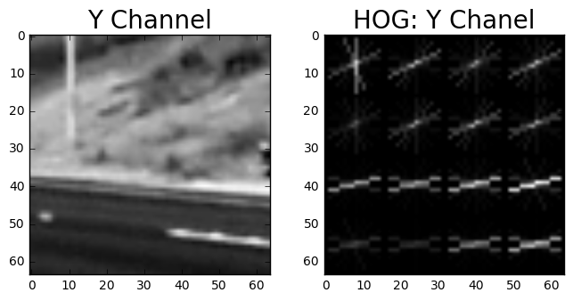
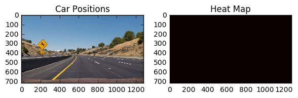

# **Vehicle Detection and Tracking**

In this project, I wrote a pipeline for detecting vehicles on the road and marking their position on the video. In order to achieve this, I used different computer vision techniques according to the following steps 

Step 1: Reading and preprocessing some training images that include examples of 64x64 pixel images of car and non-car objects.

Step 2: Analyzing the image features using histogram of gradients (HOG) and colors so that some good candidates can be fed to a classifier.

Step 3: Choosing and training an image classifer which helps to identify the cars on the road that appear in the camera view of the self-driving car.

Step 4: Applying a sliding window technique for the classifier to scan the video frames and detect cars appearing in different locations of the frame.

Step 5: Applying a heatmap to detect a more exact position of the cars within a single frame and dump the false positives. 

Step 6: Running the pipline on a test video and applying filters to eliminate the remaining false positives and also produce a more reliable position estimation of the detected cars.


# Step 1: reading the preprocessing the images

In this step, I collect the addresses of the image files and categorize them into cars and notcars.


```python
# Code Cell 1: some general functions for reading and plotting images

#importing some useful packages
import matplotlib.pyplot as plt
import matplotlib.image as mpimg
import numpy as np
import cv2
import math
%matplotlib inline


# Take two images with their titles and plot them next to each other
def plot2figs(fig1,title1,fig2,title2, fsize = (6,6)):
    f, (ax1, ax2) = plt.subplots(1, 2, figsize=(fsize[0], fsize[1]))
    f.tight_layout()
    # plot a color image 
    if len(fig1.shape) == 3:
        ax1.imshow(fig1)
    # or if it is black and white, use a gray color mapping
    else:
        ax1.imshow(fig1, cmap='gray')
    ax1.set_title(title1, fontsize=20)
    if len(fig2.shape) == 3:
        ax2.imshow(fig2)
    else:
        ax2.imshow(fig2, cmap='gray')
    ax2.set_title(title2, fontsize=20)
    plt.subplots_adjust(left=0., right=1, top=0.9, bottom=0.)
    plt.show()

# a function for making a list of the names of the images
def add_to_image_list(image_names,image_list):
    for image in image_names:
        image_list.append(image)
        
# making a list of cars and notcars image information        
def data_look(car_list, notcar_list):
    data_dict = {}
    # Defining keys in data_dict "n_cars" and store the number of car images
    data_dict["n_cars"] = len(car_list)
    # Defining keys in data_dict "n_notcars" and store the number of notcar images
    data_dict["n_notcars"] = len(notcar_list)
    # Read in a test image, either car or notca
    img = mpimg.imread(car_list[0])
    # Defining a key "image_shape" and store the test image shape 3-tuple
    data_dict["image_shape"] = img.shape
    # Defining a key "data_type" and store the data type of the test image.
    data_dict["data_type"] = img.dtype
    # Return data_dict
    return data_dict
```


```python
# Code cell 2: reading image locations
import glob
# data exploration
print('Step 1: reading images')
# read the car and not car images
cars = []
notcars = []
images = glob.glob('vehicles/vehicles/GTI_Far/image*.png')
add_to_image_list(images,cars)
images = glob.glob('vehicles/vehicles/GTI_Left/image*.png')
add_to_image_list(images,cars)
images = glob.glob('vehicles/vehicles/GTI_Right/image*.png')
add_to_image_list(images,cars)
images = glob.glob('vehicles/vehicles/GTI_MiddleClose/image*.png')
add_to_image_list(images,cars)
images = glob.glob('vehicles/vehicles/KITTI_extracted/*.png')
add_to_image_list(images,cars)
images = glob.glob('non-vehicles/non-vehicles/Extras/extra*.png')
add_to_image_list(images,notcars)
images = glob.glob('non-vehicles/non-vehicles/GTI/image*.png')
add_to_image_list(images,notcars)

data_info = data_look(cars, notcars)

print('A total of ', 
      data_info["n_cars"], ' cars and', 
      data_info["n_notcars"], ' non-cars where found in the database images (i.e. balanced samples)')
print('of size: ',data_info["image_shape"], ' and data type:', 
      data_info["data_type"])


car_ind = np.random.randint(0, len(cars))
notcar_ind = np.random.randint(0, len(notcars))
    
# Read in car / not-car images
car_image = mpimg.imread(cars[car_ind])
notcar_image = mpimg.imread(notcars[notcar_ind])


plot2figs(car_image,'A Car Image',notcar_image,'A Not-car Image')
```

    Step 1: reading images
    A total of  8792  cars and 8968  non-cars where found in the database images (i.e. balanced samples)
    of size:  (64, 64, 3)  and data type: float32


# Step 2: Analyzing the image features

## Rubrice: Explain how (and identify where in your code) you extracted HOG features from the training images. Explain how you settled on your final choice of HOG parameters.*


Answer: I tried different color spaces such as RGB, HSV, HLS, and YCrCb with either all channels included or just a specific indivdual channel. I also used different cell and block sizes for the HOG feature exctractor. I realized that some color spaces produce results that look similar to each other (for example HSV and YCrCb). However, when fed to the classifier they lead to slightly different test accuracies. The best results that I obtained was for the YCrCb color space with color histgrams with 32 bins and an HOG with 16 pixels per cell and 2x2 cell per block and 9 orientation bins. For this setting, I obtained a 99%+ test accuracy. When I added the spatial color feature it increased the input size for the classifier and resulted in even lower accuracy. Therefore, I just used the HOG and color histogram features. Finally, this combination of HOG parameters results in a much smaller feature length compared to some other good combinations. For example, with the combination used in this report, we have the following feature length:

1068 = 3X32 color histogram bins + (3 channels)X(9 bins)X(3x3 blocks)X(2x2 cells per block)

while with another somehow good confiugration (e.g. color histgrams with 32 bins and an HOG with 8 pixels per cell and 2x2 cell per block and 9 orientation bins) we have the following feature length:

5338 = 3X32 color histogram bins + (3 channels)X(9 bins)X(7x7 blocks)X(2x2 cells per block)


Code cells 3 details the functions and Code celland 4 shows an example of the results.


```python
#Code Cell 3: Some functions for processing the image features

from skimage.feature import hog
        
# HOG features and visualization 
def get_hog_features(img, orient, pix_per_cell, cell_per_block, vis=False, feature_vec=True):
    # Return the features and modified image when visualization is required 
    if vis == True:
        features, hog_image = hog(img, orientations=orient, pixels_per_cell=(pix_per_cell, pix_per_cell),
                                  cells_per_block=(cell_per_block, cell_per_block), transform_sqrt=True, 
                                  visualise=vis, feature_vector=feature_vec)
        return features, hog_image
    # Otherwise call with one output
    else:      
        features = hog(img, orientations=orient, pixels_per_cell=(pix_per_cell, pix_per_cell),
                       cells_per_block=(cell_per_block, cell_per_block), transform_sqrt=True, 
                       visualise=vis, feature_vector=feature_vec)
        return features    
    
# A function for computing binned color features: returns a "spatial_size*spatial_size*channels" row matrix
def bin_spatial(img, size=(32, 32)):
    color1 = cv2.resize(img[:,:,0], size).ravel()
    color2 = cv2.resize(img[:,:,1], size).ravel()
    color3 = cv2.resize(img[:,:,2], size).ravel()
    return np.hstack((color1, color2, color3))

# A function for computing color histogram features: returns a channels*nbins row matrix, it is useful for indentifying
# the intensities of the colors in an image
def color_hist(img, nbins=32, bins_range=(0, 256)):
    # Compute the histogram of the color channels separately
    channel1_hist = np.histogram(img[:,:,0], bins=nbins, range=bins_range)
    channel2_hist = np.histogram(img[:,:,1], bins=nbins, range=bins_range)
    channel3_hist = np.histogram(img[:,:,2], bins=nbins, range=bins_range)
    # Concatenate the histograms into a single feature vector
    hist_features = np.concatenate((channel1_hist[0], channel2_hist[0], channel3_hist[0]))
    return hist_features   
```


```python
# Code Cell 4:

# Define HOG parameters
orient = 9
pix_per_cell = 16
cell_per_block = 2
# Read two images from the cars and not cars list:
test_image = []
test_image.append(mpimg.imread(cars[car_ind]))
test_image.append(mpimg.imread(notcars[notcar_ind]))

for image in test_image:  
    # making sure the image read is in 0-255 because mpimg.imread reads the png files in 0-1 range
    image_255 = np.uint8(image*255)
    ycrcb = cv2.cvtColor(image_255, cv2.COLOR_RGB2YCrCb)
    features, hog_image_y = get_hog_features(ycrcb[:,:,0], orient, 
                            pix_per_cell, cell_per_block, 
                            vis=True, feature_vec=False)
    features, hog_image_cr = get_hog_features(ycrcb[:,:,1], orient, 
                            pix_per_cell, cell_per_block, 
                            vis=True, feature_vec=False)

    features, hog_image_cb = get_hog_features(ycrcb[:,:,2], orient, 
                            pix_per_cell, cell_per_block, 
                            vis=True, feature_vec=False)
    print('Raw image and an example of its color channels and HOG')
    plt.imshow(image)
    plot2figs(ycrcb[:,:,0], 'Y Channel', hog_image_y,'HOG: Y Chanel')
    plot2figs(ycrcb[:,:,1], 'Cr Channel', hog_image_cr,'HOG: Cr Channel')
    plot2figs(ycrcb[:,:,2], 'Cb Channel', hog_image_cb,'HOG: Cb Channel')
```

    Raw image and an example of its color channels and HOG


    Raw image and an example of its color channels and HOG





# Step 3: Choosing and training an image classifer

## Rubric: Describe how (and identify where in your code) you trained a classifier using your selected HOG features (and color features if you used them).

Answer: The code cell 5 includes functions that extract image features. The code cell 6 includes the training code for a SVM classifier with a "poly" kernel. In order to train the classifier, I completed the following steps:

1) Choosing feature extraction parameters and extracting the features

2) Normalizing the features using "StandardScaler().fit(X)" and "scaler.transform(X)" commands

3) Making a list of labels in "y" (output) vector and splitting the data to train and test sets

4) Training the classifier using the train set

5) Examining the accuracy of the trained classifier on the test set


```python
#Code Cell 5:
# a function for extracting the features of a single image using HOG, color histograms and 
#spatial color features for different color selected colorspaces
def single_img_features(img, color_space='RGB', spatial_size=(32, 32),
                        hist_bins=32, orient=9, 
                        pix_per_cell=8, cell_per_block=2, hog_channel=0,
                        spatial_feat=True, hist_feat=True, hog_feat=True): 
    img_features = []
    #Apply color conversion if other than 'RGB'
    if color_space != 'RGB':
        if color_space == 'HSV':
            feature_image = cv2.cvtColor(img, cv2.COLOR_RGB2HSV)
        elif color_space == 'LUV':
            feature_image = cv2.cvtColor(img, cv2.COLOR_RGB2LUV)
        elif color_space == 'HLS':
            feature_image = cv2.cvtColor(img, cv2.COLOR_RGB2HLS)
        elif color_space == 'YUV':
            feature_image = cv2.cvtColor(img, cv2.COLOR_RGB2YUV)
        elif color_space == 'YCrCb':
            feature_image = cv2.cvtColor(img, cv2.COLOR_RGB2YCrCb)
    else: feature_image = np.copy(img) 
    # Compute spatial features if flag is set: returns a "spatial_size*spatial_size*channels" row matrix
    if spatial_feat == True:
        spatial_features = bin_spatial(feature_image, size=spatial_size)
        #4) Append features to list
        img_features.append(spatial_features)
    # Compute histogram features if flag is set: returns a "spatial_size*spatial_size*channels" row matrix
    if hist_feat == True:
        hist_features = color_hist(feature_image, nbins=hist_bins, bins_range=(0, 256))
        #6) Append features to list
        img_features.append(hist_features)
    # Compute HOG features if flag is set
    if hog_feat == True:
        if hog_channel == 'ALL':
            hog_features = []
            for channel in range(feature_image.shape[2]):
                # extend or append probably extend does not need ravel at the end
                hog_features.extend(get_hog_features(feature_image[:,:,channel], 
                                    orient, pix_per_cell, cell_per_block, 
                                    vis=False, feature_vec=True))
        else:       
            hog_features = get_hog_features(feature_image[:,:,hog_channel], orient, 
                        pix_per_cell, cell_per_block, vis=False, feature_vec=True)                
        # Append features to list
        img_features.append(hog_features)
    # Return concatenated array of features
    return np.concatenate(img_features)


    

# a function for looping through the images and extracting the features
def extract_features(imgs, cspace='RGB', spatial_size=(32, 32),
                        hist_bins=32, hist_range=(0, 256), orient=9, 
                        pix_per_cell=8, cell_per_block=2, hog_channel=0,
                        spatial_feat=True, hist_feat=True, hog_feat=True):
    features = []
    # Iterate through the list of images
    for file in imgs:
        # Read in one by one
        img_raw = mpimg.imread(file)
        # making sure the image read is in 0-255 because mpimg.imread reads the png files in 0-1 range
        img = np.uint8(img_raw*255)        
        single_feature = single_img_features(img, color_space=cspace,
                            spatial_size=spatial_size, hist_bins=hist_bins, 
                            orient=orient, pix_per_cell=pix_per_cell, 
                            cell_per_block=cell_per_block, 
                            hog_channel=hog_channel, spatial_feat=spatial_feat, 
                            hist_feat=hist_feat, hog_feat=hog_feat)
        features.append(single_feature)
    # Return list of feature vectors
    return features

```


```python
# Code cell 6:
from sklearn.preprocessing import StandardScaler
from sklearn.svm import SVC
from sklearn.cross_validation import train_test_split
import time

# choosing the feature extraction parameters
spatial = 32
histbin = 32
colorspace = 'YCrCb' # Can be RGB, HSV, LUV, HLS, YUV, YCrCb
hog_channels = 'ALL' # Can be 0, 1, 2, or "ALL"
orientation = 9
pixel_per_cell = 16
cells_per_block = 2
spatial_features= False
hist_features= True
hog_features= True

print('Step 3.1: extracting features')
t=time.time()

car_features = extract_features(cars, cspace=colorspace, spatial_size=(spatial, spatial),
                        hist_bins=histbin, hist_range=(0, 256), 
                        orient=orientation,pix_per_cell=pixel_per_cell, cell_per_block=cells_per_block,
                        hog_channel=hog_channels, spatial_feat = spatial_features,
                        hist_feat = hist_features, hog_feat = hog_features)
notcar_features = extract_features(notcars, cspace=colorspace, spatial_size=(spatial, spatial),
                        hist_bins=histbin, hist_range=(0, 256), 
                        orient=orientation,pix_per_cell=pixel_per_cell, cell_per_block=cells_per_block,
                        hog_channel=hog_channels, spatial_feat = spatial_features,
                        hist_feat = hist_features, hog_feat = hog_features)
t2 = time.time()
print(round(t2-t, 2), 'Seconds to extract features...')
print('number of car features:', len(car_features))
print('number of noncar features:', len(notcar_features))

# Create an array stack of feature vectors

X = np.vstack((car_features, notcar_features)).astype(np.float64) 
print('Total number of extracted features:', len(X))
# Fit a per-column scaler => used later to transform the test data using some information about the training set
print('\nStep 3.2: normalization:')
X_scaler = StandardScaler().fit(X)
# Apply the scaler to X
scaled_X = X_scaler.transform(X)
print('Normalization completed')
# Plot an example of raw and scaled features
car_ind = np.random.randint(0, len(cars)) 
image = mpimg.imread(cars[car_ind])
gray = cv2.cvtColor(image, cv2.COLOR_RGB2GRAY)
fig = plt.figure(figsize=(12,4))
plt.subplot(131)
plt.imshow(image)
plt.title('Original Image')
plt.subplot(132)
plt.plot(X[car_ind])
plt.title('Raw Features')
plt.subplot(133)
plt.plot(scaled_X[car_ind])
plt.title('Normalized Features')
fig.tight_layout()

print('\nStep 3.3: Labeling the data and splitting them')
# Split up data into randomized training and test sets
rand_state = np.random.randint(0, 100)
print('random seed', rand_state)
# Define the labels vector
y = np.hstack((np.ones(len(car_features)), np.zeros(len(notcar_features))))
X_train, X_test, y_train, y_test = train_test_split(scaled_X, y, test_size=0.2, random_state=rand_state)
print(len(X_train), 'train samples and ', len(X_test), 'test samples are obtained')
print('\nStep 3.4: Training the classifier')
if spatial_features:
    print('Using spatial binning of:',spatial)
if hist_features:
    print('Using', histbin,'histogram bins')
if hog_features:
    print('Using:',orientation,'orientations',pixel_per_cell,
        'pixels per cell and', cells_per_block,'cells per block')
print('Feature vector length:', len(X_train[0]))
# defining the classifier
svc = SVC(kernel="poly")
# Check the training time for the SVC
t=time.time()
# training the classifier
svc.fit(X_train, y_train)
t2 = time.time()
print(round(t2-t, 2), 'Seconds to train SVC...')
print('\nStep 3.5: Testing the accuracy:')
# Check the score of the SVC
print('Test Accuracy of SVC = ', round(svc.score(X_test, y_test), 4))
# Check the prediction time for a single sample
t=time.time()
n_predict = 10
print('My SVC predicts: ', svc.predict(X_test[0:n_predict]))
print('For these',n_predict, 'labels: ', y_test[0:n_predict])
t2 = time.time()
print(round(t2-t, 5), 'Seconds to predict', n_predict,'labels with SVC')

```

    Step 3.1: extracting features
    48.51 Seconds to extract features...
    number of car features: 8792
    number of noncar features: 8968
    Total number of extracted features: 17760
    
    Step 3.2: normalization:
    Normalization completed
    
    Step 3.3: Labeling the data and splitting them
    random seed 67
    14208 train samples and  3552 test samples are obtained
    
    Step 3.4: Training the classifier
    Using 32 histogram bins
    Using: 9 orientations 16 pixels per cell and 2 cells per block
    Feature vector length: 1068
    74.65 Seconds to train SVC...
    
    Step 3.5: Testing the accuracy:
    Test Accuracy of SVC =  0.9935
    My SVC predicts:  [ 1.  1.  1.  1.  1.  1.  0.  1.  1.  1.]
    For these 10 labels:  [ 1.  1.  1.  1.  1.  1.  0.  1.  1.  1.]
    0.04972 Seconds to predict 10 labels with SVC


```python
# Code Cell 7:
# function for drawing boxes on an image
def draw_boxes(img, bboxes, color=(0, 0, 255), thick=6):
    # Make a copy of the image
    imcopy = np.copy(img)
    # Iterate through the bounding boxes
    for bbox in bboxes:
        # Draw a rectangle given bbox coordinates
        cv2.rectangle(imcopy, bbox[0], bbox[1], color, thick)
    # Return the image copy with boxes drawn
    return imcopy
     
# function that makes a list of sliding windows and adds to an input list
def slide_window(img, x_start_stop=[None, None], y_start_stop=[None, None], 
                    xy_window=(64, 64), xy_overlap=(0.5, 0.5),window_list=[]):
    # If x and/or y start/stop positions not defined, set to image size
    # If x and/or y start/stop positions not defined, set to image size
    if x_start_stop[0] == None:
        x_start_stop[0] = 0
    if x_start_stop[1] == None:
        x_start_stop[1] = img.shape[1]
    if y_start_stop[0] == None:
        y_start_stop[0] = 0
    if y_start_stop[1] == None:
        y_start_stop[1] = img.shape[0]
    # Compute the span of the region to be searched    
    xspan = x_start_stop[1] - x_start_stop[0]
    yspan = y_start_stop[1] - y_start_stop[0]
    # Compute the number of pixels per step in x/y
    nx_pix_per_step = np.int(xy_window[0]*(1 - xy_overlap[0]))
    ny_pix_per_step = np.int(xy_window[1]*(1 - xy_overlap[1]))
    # Compute the number of windows in x/y
    nx_buffer = np.int(xy_window[0]*(xy_overlap[0]))
    ny_buffer = np.int(xy_window[1]*(xy_overlap[1]))
    nx_windows = np.int((xspan-nx_buffer)/nx_pix_per_step) 
    ny_windows = np.int((yspan-ny_buffer)/ny_pix_per_step) 
    # start calculating the window coordinates and adding them to the list
    for ys in range(ny_windows):
        for xs in range(nx_windows):
            # Calculate window position
            startx = xs*nx_pix_per_step + x_start_stop[0]
            endx = startx + xy_window[0]
            starty = ys*ny_pix_per_step + y_start_stop[0]
            endy = starty + xy_window[1]
            # Append window position to list
            window_list.append(((startx, starty), (endx, endy)))
    # Return the list of windows
    return window_list    

```

# Step 4: Applying a sliding window

## Rubric: Describe how (and identify where in your code) you implemented a sliding window search. How did you decide what scales to search and how much to overlap windows?

Answer: The box drawing function and sliding window functions are detailed in code cell 7. Code cell 8 contains an example with the logic behind the choices of multi-scale windows. I chose an image (in the following when you run code cell 8) that contains two cars in the camera view of the self-driving car. The black car is located very close while the white car is far in the horizon. From this image, it can be seen that an minimum size of 96x96 pixels and a maximum size of 288x288 pixels can capture most of the car sizes appearing in the video frame. I picked these values with three other equally distributed window sizes in between (64 pixel increaments in length and width). One example of the multi-scale sliding windows can be seen in the following figures. I choose and overlap of 75% after some to make a balance between accuracy and speed of the search algorithm after some trial and error.


```python
# code cell 8: example of the implementation of sliding windows

image = mpimg.imread('test_images/extra5.jpg')
font = 1
red_boxes = [((850, 390), (946, 486)),((992, 380), (1280, 668))]
test = draw_boxes(image,red_boxes, color=(255, 0, 0), thick=6) 
cv2.putText(test, '288 by 288 px',(1000,350), font, 2,(255,255,255),2,cv2.LINE_AA)
cv2.putText(test, '96 by 96 px',(600,450), font, 2,(255,255,255),2,cv2.LINE_AA)
print('An approximation of the minimum and maximum window sizes for far (small) and close (large) cars')
plt.imshow(test)
plt.show()


print('Creating a multi-scale sliding window list. See the following image as an example.')
print('Window sizes: 96x96, 160x160, 224x224, 288x288 with 75% overlap.')
xy_overlaps = .75
global multi_windows
multi_windows = []
multi_windows=slide_window(image, x_start_stop=[None, None], y_start_stop=[380,540], 
                   xy_window=(96, 96), xy_overlap=(xy_overlaps, xy_overlaps), window_list = multi_windows)
multi_windows=slide_window(image, x_start_stop=[None, None], y_start_stop=[400,668], 
                   xy_window=(160, 160), xy_overlap=(xy_overlaps, xy_overlaps), window_list = multi_windows)
multi_windows=slide_window(image, x_start_stop=[None, None], y_start_stop=[400,668], 
                   xy_window=(224, 224), xy_overlap=(xy_overlaps, xy_overlaps), window_list = multi_windows)
multi_windows=slide_window(image, x_start_stop=[None, None], y_start_stop=[400,668], 
                   xy_window=(288, 288), xy_overlap=(xy_overlaps, xy_overlaps), window_list = multi_windows)


test = draw_boxes(image, multi_windows, color=(0, 0, 255), thick=6) 
plt.imshow(test)
plt.show()


```

    An approximation of the minimum and maximum window sizes for far (small) and close (large) cars


    Creating a multi-scale sliding window list. See the following image as an example.
    Window sizes: 96x96, 160x160, 224x224, 288x288 with 75% overlap.


# Step 5: Applying a heatmap to detect a more exact position of the cars within a single frame and dump the false positives. 

## Rubric: Show some examples of test images to demonstrate how your pipeline is working. How did you optimize the performance of your classifier?
	

Answer: I provided the required functions in code cell 9. Code cell 10 provides some examples of the car detection using the trained classifer. I increased the accuracy of the classifer by:

1) Choosing a combination of features that result in a test accuracy of above 99% (See steps 2 and 3).

2) Choosing larger values of overlap between the sliding windows (I chose 75% rather than the initial value of 50%.)

3) I used a heatmap to reduce the number of false positives. When a car is detected by multiple windows, the heatmap shows larger values. For random false positives the heatmap returns small values which can be easilly filtered using a threshold. 

4) I applied a modified draw_labled_boxes function which estimates a wider box when cars appear on the sides rather than front. It also roughly estimates the car height depending on where it (the centeroid of heatmap) appears on the vertical axis. Generally, closer cars appear larger and lower on the image and vice versa.


```python
#Code cell 9
# function for searching through the sliding windows and looking for cars: it returns the windows that detect cars
def search_windows(img, windows, clf, scaler, color_space='RGB', 
                    spatial_size=(32, 32), hist_bins=32, 
                    hist_range=(0, 256), orient=9, 
                    pix_per_cell=8, cell_per_block=2, 
                    hog_channel=0, spatial_feat=True, 
                    hist_feat=True, hog_feat=True):
    #1) Create an empty list to receive positive detection windows
    on_windows = []
    #2) Iterate over all windows in the list
    for window in windows:
        #3) Extract the test window from original image
        test_img = cv2.resize(img[window[0][1]:window[1][1], window[0][0]:window[1][0]], (64, 64)) 
        #4) Extract features for that window using single_img_features()
        features = single_img_features(test_img, color_space = color_space, 
                            spatial_size=spatial_size, hist_bins=hist_bins, 
                            orient=orient, pix_per_cell=pix_per_cell, 
                            cell_per_block=cell_per_block, 
                            hog_channel=hog_channel, spatial_feat=spatial_feat, 
                            hist_feat=hist_feat, hog_feat=hog_feat)
        #5) Scale extracted features to be fed to classifier
        test_features = scaler.transform(np.array(features).reshape(1, -1))
        #6) Predict using your classifier
        prediction = clf.predict(test_features)
        #7) If positive (prediction == 1) then save the window
        if prediction == 1:
            on_windows.append(window)
    #8) Return windows for positive detections
    return on_windows

# function for calculating heatmap using positive detection windows
def add_heat(heatmap, bbox_list):
    # Iterate through list of bboxes
    for box in bbox_list:
        # Add += 1 for all pixels inside each bbox
        # Assuming each "box" takes the form ((x1, y1), (x2, y2))
        heatmap[box[0][1]:box[1][1], box[0][0]:box[1][0]] += 1
    # Return updated heatmap
    return heatmap# Iterate through list of bboxes

# function for applying a preliminary filtering on the positive detection windows using the heatmap
def apply_threshold(heatmap, threshold):
    # Zero out pixels below the threshold
    heatmap[heatmap <= threshold] = 0
    # Return thresholded map
    return heatmap


# function that processes the heatmap and estimates box containing the location of the car
def draw_labeled_bboxes2(img, labels,heat):
    # Iterate through all detected cars
    for car_number in range(1, labels[1]+1):
        # Find pixels with each car_number label value
        nonzero = (labels[0] == car_number).nonzero()
        # Identify x and y values of those pixels
        nonzeroy = np.array(nonzero[0])
        nonzerox = np.array(nonzero[1])
        heat_max = 0
        max_list = []
        # find the maximum value of heatmap
        for x,y in zip(nonzerox,nonzeroy):
            if heat[y][x] > heat_max:
                heat_max = heat[y][x]
        # find where in the heatmap the maximum apears
        for x,y in zip(nonzerox,nonzeroy):
            if heat[y][x] ==heat_max:
                max_list.append((y,x))
        #calculate the average location of the maximum heat values as the center of the car
        cg = np.mean(max_list, axis=0)
        # find the scale of car width campred to its hight depending on the horizontal location of the car
        x_scale = np.abs(cg[1]-640)/640+1
        # estimate the car height depending on the vertical location of the car
        car_height = 192*(cg[0] -436)/88+64
        # estimate the car width using the width scale and car height
        car_width = car_height*x_scale
        # find the coreners of the surrounding box
        car_left = max(int(cg[1]-car_width/2),0)
        car_right = min(int(cg[1]+car_width/2),1280)
        car_top = int(cg[0]-car_height/2)
        car_bottom = min(int(cg[0]+car_height/2),668)
        # Define a bounding box based on min/max x and y
        bbox = ((car_left, car_top), (car_right, car_bottom))
        # Draw the box on the image
        cv2.rectangle(img, bbox[0], bbox[1], (0,0,255), 6)
    # Return the image
    return img
```


```python
# Code cell 10:
from scipy.ndimage.measurements import label
#reading some example images and processing them
heat_thresh = 1

test_images = glob.glob('test_images/test*.jpg')
for test_image in test_images:
    image = mpimg.imread(test_image)
    #printing out some stats and plotting

    hot_windows = search_windows(image, multi_windows, svc, X_scaler, color_space=colorspace,
                            spatial_size=(spatial,spatial), hist_bins=histbin, hist_range=(0, 256),
                            orient=orientation, pix_per_cell=pixel_per_cell, 
                            cell_per_block=cells_per_block, 
                            hog_channel=hog_channels, spatial_feat=spatial_features, 
                            hist_feat=hist_features, hog_feat=hog_features)                       

    window_img = draw_boxes(image, hot_windows, color=(0, 0, 255), thick=6)                    

    plt.title('Initial positive detections')
    plt.imshow(window_img)

    heat = np.zeros_like(image[:,:,0]).astype(np.float)

    # Add heat to each box in box list
    heat = add_heat(heat,hot_windows)

    # Apply threshold to help remove false positives

    heat = apply_threshold(heat,heat_thresh)

    # Visualize the heatmap when displaying    
    heatmap = np.clip(heat, 0, 255)

    # Find final boxes from heatmap using label function
    labels = label(heatmap)

    # estimate the car position and draw a box on it
    draw_img = draw_labeled_bboxes2(np.copy(image), labels,heatmap)


    fig = plt.figure()
    plt.subplot(121)
    plt.imshow(draw_img)
    plt.title('Car Positions')
    plt.subplot(122)
    plt.imshow(heatmap, cmap='hot')
    plt.title('Heat Map')
    fig.tight_layout()
    plt.show()


```





# Step 6: Running the pipline on a test video.

## Rubric: Provide a link to your final video output. Your pipeline should perform reasonably well on the entire project video (somewhat wobbly or unstable bounding boxes are ok as long as you are identifying the vehicles most of the time with minimal false positives.)
	
Answer: I utilized all the results from the previous steps in the video processing function in Code Cell 11. Code cell 12 uses these functions on each video frame and produces the final video. Please see the uploaded video for the results. 


## Rubric: Describe how (and identify where in your code) you implemented some kind of filter for false positives and some method for combining overlapping bounding boxes.
	
Answer: In code cell 11, I apply a simple low pass filtering method on the heatmap. With this filter, if a positive detection box appears for a long time, the filtered heatmap producess larger values. Otherwise, for false positives that just appear in 1 or 2 frames, the filtered heatmap values are small and easilly cut when applying the threshold on the heatmap.


```python
# Code Cell 11: video frame processing functions:
# Import everything needed to edit/save/watch video clips
from moviepy.editor import VideoFileClip
from IPython.display import HTML
# video editor: In the following, I use the summary of the results shown above for an example image to process video frames

def process_video(image):
    global prev_heatmap # for keeping the previous value of heatmap used in the low-pass filter
    global multi_windows# for reading the sliding windows that are calculated and fixed for all frames.

    # Obtaining the positive detections
    hot_windows = search_windows(image, multi_windows, svc, X_scaler, color_space=colorspace,
                        spatial_size=(spatial,spatial), hist_bins=histbin, hist_range=(0, 256),
                        orient=orientation, pix_per_cell=pixel_per_cell, 
                        cell_per_block=cells_per_block, 
                        hog_channel=hog_channels, spatial_feat=spatial_features, 
                        hist_feat=hist_features, hog_feat=hog_features)               
    
    heat = np.zeros_like(image[:,:,0]).astype(np.float)

    # Add heat to each box in box list
    heat = add_heat(heat,hot_windows)
    # a low pass filter on the heatmap to eliminate the effects of false positives appearing in just 1 or 2 frames
    tau = 0.75
    heat = (1-tau)*heat+tau*prev_heatmap
    prev_heatmap = heat
    # Apply threshold to help remove false positives
    heat = apply_threshold(heat,heat_thresh)

    # Visualize the heatmap when displaying    
    heatmap = np.clip(heat, 0, 255)

    # Find final boxes from heatmap using label function
    labels = label(heatmap)

    #print(labels)
    #draw_img = draw_labeled_bboxes(np.copy(image), labels)
    results = draw_labeled_bboxes2(np.copy(image), labels,heatmap)
    

    
    return results
```


```python
# Code Cell 12
white_output = 'main_video.mp4'
clip1 = VideoFileClip("project_video.mp4")
# some previous values for the low-pass filter applied in the lane detections with their initial values
global prev_heatmap

prev_heatmap = np.zeros_like(image[:,:,0]).astype(np.float)


white_clip = clip1.fl_image(process_video) #NOTE: this function expects color images!!
%time white_clip.write_videofile(white_output, audio=False)

```

    [MoviePy] >>>> Building video main_video.mp4
    [MoviePy] Writing video main_video.mp4


    100%|█████████▉| 1260/1261 [41:05<00:01,  1.97s/it]


    [MoviePy] Done.
    [MoviePy] >>>> Video ready: main_video.mp4 
    
    CPU times: user 41min, sys: 2.44 s, total: 41min 3s
    Wall time: 41min 5s


[](https://youtu.be/5WrVHzP_GPQ)

# Discussion

## Briefly discuss any problems / issues you faced in your implementation of this project. Where will your pipeline likely fail? What could you do to make it more robust?

My biggest challenge was paramater tuning for making a balance between the speed and accuracy of the pipeline. Right now, the pipepline is relatively robust but slow. However, when two cars appear close to each other, at some points it is hard to distinguish them from each other. This can be solved by increasing the window overlaps which degrades the speed of pipeline even more. The heatmap filtering can also be improved slightly. If I had time, I would work on optimizing some parts of the pipeline to make it run faster.


```python

```
